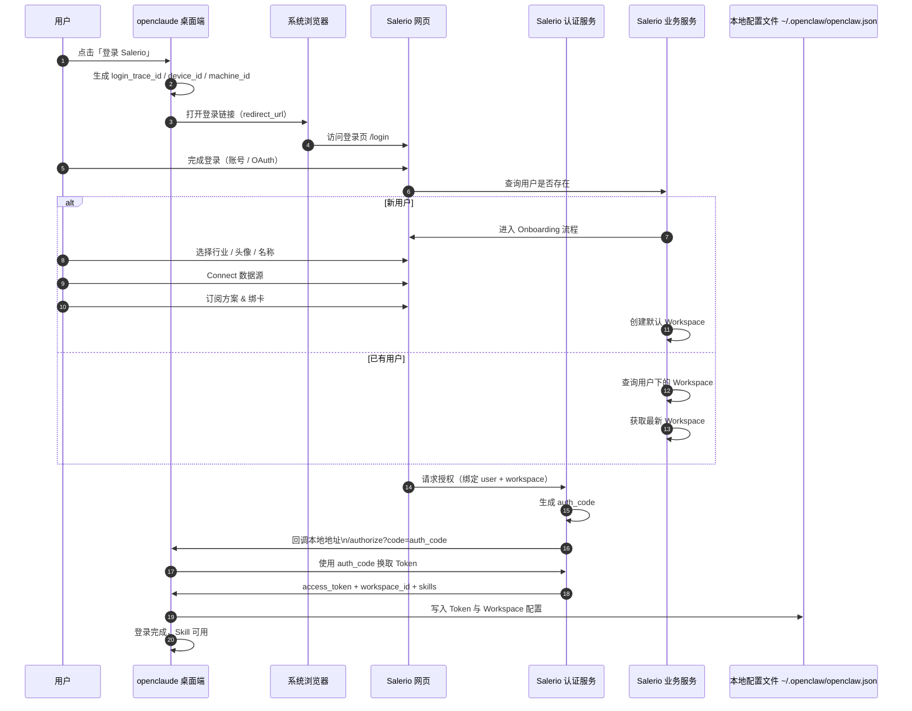

# OpenClaude 桌面端登录升级方案

## 一、核心职责划分

- **openclaude 桌面端**：登录触发 + 回调接收 + 本地配置写入
- **Salerio Web**：用户存在性判断 → onboarding → workspace 管理 → 权益与 token 下发

### 核心新增两点

1. 登录后分支：是否新用户
2. 最终产物：token + workspace_id，并写入 `~/.openclaw/openclaw.json`

---

## 二、升级后的整体流程拆解

### 1️⃣ 桌面端点击登录（不变）

openclaude 右上角「登录 Salerio」→ 打开系统浏览器

携带参数：
- `client_id`
- `auth_callback_url`
- `device_id` / `machine_id`
- `login_trace_id`

### 2️⃣ Web 登录成功后：用户存在性判断（新增）

在 Salerio Web / Auth 服务内部：

```
是否存在 user 记录？
├── 否 → 进入 Onboarding 流程
└── 是 → 查询 workspace
```

### 3️⃣ 新用户：Onboarding 流程（新增重点）

Onboarding 包含的步骤：
- 选择行业
- 设置头像
- 设置名称
- Connect 数据源（Shopify / Ads / …）
- 订阅方案 & 绑卡
- 自动创建 Workspace
    - 设为默认 workspace
    - 用户为 Owner
    - 后续可邀请成员

> 👉 Onboarding 完成才算"可用用户"

### 4️⃣ 老用户：Workspace 获取逻辑（新增）

如果用户已存在：
1. 查询该用户下的 workspaces
2. 按规则选一个（例如）：
    - 最近活跃的
    - 最近创建的

得到：`workspace_id`

### 5️⃣ 授权完成：回调桌面端（升级）

此时 Salerio Auth 服务会：
1. 生成 `auth_code`
2. 在内部绑定：`user_id` + `workspace_id`
3. 回调桌面端：`http://127.0.0.1:{port}/authorize?code=xxx`

### 6️⃣ 桌面端用 auth_code 换取"增强 Token"（升级）

桌面端调用：`POST /oauth/token`

返回内容必须包含：

```json
{
  "access_token": "...",
  "refresh_token": "...",
  "workspace_id": "uuid",
  "skills": [],
  "expires_in": 7200
}
```

> 📌 这是你这次设计的关键目标

### 7️⃣ 桌面端写入本地配置文件

**文件路径**：`~/.openclaw/openclaw.json`

**写入逻辑**（只保留必要内容）：

```json
{
  "skills": {
    "install": {
      "nodeManager": "npm"
    },
    "entries": {
      "search-data": {
        "enabled": true,
        "env": {
          "SEARCH_DATA_TOKEN": "<access_token>",
          "SEARCH_DATA_WORKSPACE_ID": "<workspace_id>"
        }
      }
    }
  }
}
```

> 📌 桌面端后续所有 Skill 执行：不再关心登录，只读取这个配置文件

---

## 三、升级后的 Mermaid 时序图

这张图 = 你现在这套系统的"正式版蓝图"


