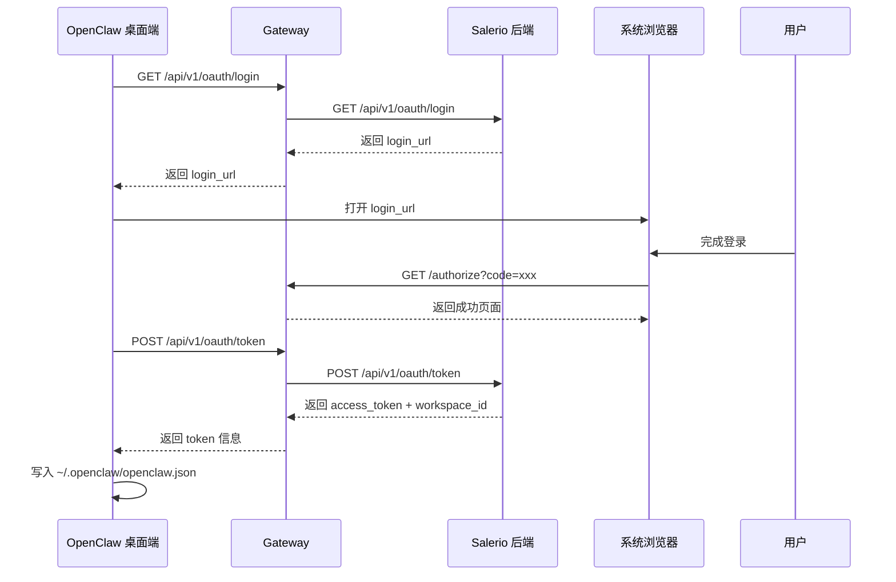

# OpenClaw × Salerio 登录集成 API 接口规范

## 概述

本文档定义 OpenClaw 桌面端与 Salerio 后端服务之间的 OAuth 风格登录集成接口。

---

## 一、接口列表

| 序号 | 接口名称 | 方向 | 用途 |
|------|----------|------|------|
| 1 | 发起登录 | 桌面端 → Salerio | 触发登录流程，获取登录 URL |
| 2 | 登录回调 | Salerio → 桌面端 | 授权完成回调，携带 auth_code |
| 3 | Token 交换 | 桌面端 → Salerio | 用 auth_code 换取 access_token |
| 4 | 用户状态查询 | 桌面端 → Salerio | 查询当前登录用户信息 |

---

## 二、接口详细定义

### 2.1 发起登录

**接口说明**：桌面端调用此接口获取登录 URL 和相关参数，用于打开系统浏览器。

#### 请求

```http
GET /api/v1/oauth/login
```

**Query 参数：**
  
| 参数 | 类型 | 必填 | 说明 |
|------|------|------|------|
| `client_id` | string | 是 | 客户端标识，固定值（待定） |
| `redirect_uri` | string | 是 | 回调地址，格式：`http://127.0.0.1:{port}/authorize` |
| `device_id` | string | 是 | 设备唯一标识 |
| `login_trace_id` | string | 是 | 登录追踪 ID，用于日志关联 |

#### 响应

```json
{
  "code": 0,
  "message": "success",
  "data": {
    "login_url": "https://test-www.bustly.shop/admin/auth?client_id=xxx&redirect_uri=xxx&device_id=xxx&login_trace_id=xxx",
    "login_trace_id": "uuid-xxx",
    "expires_in": 300
  }
}
```

| 字段 | 类型 | 说明 |
|------|------|------|
| `login_url` | string | 完整的登录 URL，用于浏览器打开 |
| `login_trace_id` | string | 登录追踪 ID |
| `expires_in` | number | URL 过期时间（秒） |

---

### 2.2 登录回调

**接口说明**：Salerio 授权完成后，回调此端点传递 `auth_code`。

#### 请求

```http
GET /authorize?code={auth_code}&state={login_trace_id}
```

**Query 参数：**

| 参数 | 类型 | 必填 | 说明 |
|------|------|------|------|
| `code` | string | 是 | 授权码，用于后续换取 token |
| `state` | string | 否 | 状态参数，对应 login_trace_id |

#### 响应

**成功响应：** 渲染 HTML 页面，提示用户"登录成功，请返回桌面应用"

```html
<!DOCTYPE html>
<html>
<head>
  <title>登录成功</title>
  <meta charset="utf-8">
</head>
<body>
  <h1>✅ 登录成功</h1>
  <p>您可以关闭此页面并返回 OpenClaw 桌面应用。</p>
  <script>
    // 3秒后自动关闭（如果可能）
    setTimeout(() => window.close(), 3000);
  </script>
</body>
</html>
```

**错误响应：**

```json
{
  "error": "invalid_code",
  "error_description": "Invalid authorization code"
}
```

---

### 2.3 Token 交换

**接口说明**：桌面端使用 `auth_code` 换取 `access_token` 和 `workspace_id`。

#### 请求

```http
POST /api/v1/oauth/token
Content-Type: application/json
```

**请求体：**

```json
{
  "code": "auth_code_from_callback",
  "client_id": "openclaw-desktop",
  "grant_type": "authorization_code"
}
```

| 参数 | 类型 | 必填 | 说明 |
|------|------|------|------|
| `code` | string | 是 | 授权回调中获取的 code |
| `client_id` | string | 是 | 客户端标识 |
| `grant_type` | string | 是 | 固定值：`authorization_code` |

#### 响应

**成功响应：**

```json
{
  "code": 0,
  "message": "success",
  "data": {
    "access_token": "eyJhbGciOiJIUzI1NiIs...",
    "refresh_token": "eyJhbGciOiJIUzI1NiIs...",
    "token_type": "Bearer",
    "expires_in": 7200,
    "workspace_id": "workspace-uuid-xxx",
    "user_id": "user-uuid-xxx",
    "user_name": "John Doe",
    "user_email": "john@example.com",
    "skills": ["search-data", "analytics"]
  }
}
```

| 字段 | 类型 | 说明 |
|------|------|------|
| `access_token` | string | 访问令牌，写入配置文件的 `SEARCH_DATA_TOKEN` |
| `refresh_token` | string | 刷新令牌 |
| `expires_in` | number | 过期时间（秒） |
| `workspace_id` | string | 工作区 ID，写入配置文件的 `SEARCH_DATA_WORKSPACE_ID` |
| `user_id` | string | 用户 ID |
| `user_name` | string | 用户名称 |
| `user_email` | string | 用户邮箱 |
| `skills` | string[] | 可用技能列表 |

**错误响应：**

```json
{
  "code": 40001,
  "message": "invalid_code",
  "data": null
}
```

| 错误码 | 说明 |
|--------|------|
| 40001 | 无效的授权码 |
| 40002 | 授权码已过期 |
| 40003 | 授权码已被使用 |

---

### 2.4 用户状态查询

**接口说明**：查询当前桌面端的登录状态。

#### 请求

```http
GET /api/v1/user/status
Authorization: Bearer {access_token}
```

#### 响应

**已登录响应：**

```json
{
  "code": 0,
  "message": "success",
  "data": {
    "logged_in": true,
    "user_id": "user-uuid-xxx",
    "user_name": "John Doe",
    "user_email": "john@example.com",
    "workspace_id": "workspace-uuid-xxx",
    "workspace_name": "My Workspace",
    "skills": ["search-data", "analytics"]
  }
}
```

**未登录响应：**

```json
{
  "code": 0,
  "message": "success",
  "data": {
    "logged_in": false
  }
}
```

---

## 三、通用错误码规范

| 错误码 | 说明 |
|--------|------|
| 0 | 成功 |
| 40001 | 参数错误 |
| 40002 | 无效的授权码 |
| 40003 | 授权码已过期 |
| 40004 | 授权码已被使用 |
| 40101 | 未授权（token 无效） |
| 40102 | Token 已过期 |
| 50000 | 服务器内部错误 |

---

## 四、时序图



---

## 五、配置文件写入示例

登录成功后，桌面端应写入以下配置到 `~/.openclaw/openclaw.json`：

```json
{
  "skills": {
    "install": {
      "nodeManager": "pnpm"
    },
    "entries": {
      "search-data": {
        "enabled": true,
        "env": {
          "SEARCH_DATA_TOKEN": "<access_token>",
          "SEARCH_DATA_WORKSPACE_ID": "<workspace_id>"
        }
      }
    }
  }
}
```

---

## 六、安全注意事项

1. **HTTPS**：生产环境必须使用 HTTPS
2. **Token 存储**：access_token 应加密存储在本地
3. **回调地址**：redirect_uri 必须使用 `127.0.0.1` 而非 `localhost`
4. **Code 一次性**：auth_code 只能使用一次，使用后立即失效
5. **Token 过期**：实现 refresh_token 机制自动续期

---

## 七、待确认事项

- [ ] Salerio 后端域名（生产/测试环境）
- [ ] `client_id` 固定值
- [ ] Token 有效期（建议 7200 秒）
- [ ] 是否需要刷新 Token 接口
- [ ] 是否支持多 Workspace 切换
